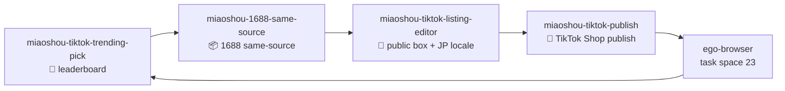
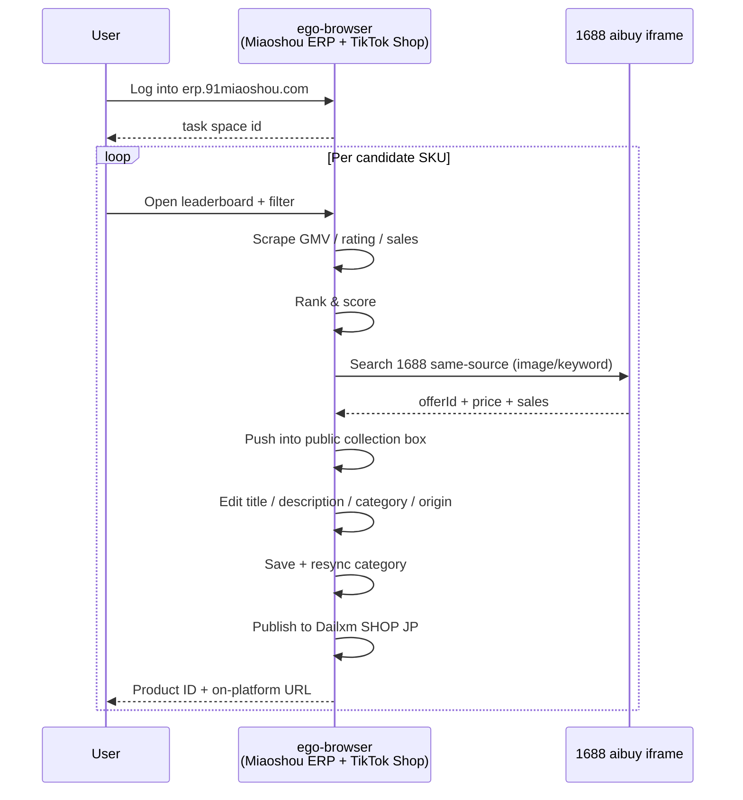

# Miaoshou × 1688 × TikTok Shop JP Skills

> A Codex skill suite that automates the full **market leaderboard → 1688 same-source → Miaoshou public collection box → TikTok Shop Japan publish** pipeline by reusing an authenticated Miaoshou ERP browser session via ego-browser.

**[简体中文](README.md)**

[](#)
[](#)
[](#)
[](#)
[](#)

## What it does

This skill suite decomposes the cross-platform manual workflow (Miaoshou ERP browser + 1688 same-source modal + TikTok Shop backend) into four sequentially-triggerable stages, each executed inside a real Chrome session.

- **Input**: Miaoshou ERP market leaderboard (or a manual candidate list) + an authorized TikTok Shop (Japan by default).
- **Output**: a `发布成功` record plus the shop URL `https://shop.tiktok.com/jp/pdp/<productId>`.
- **By-products**: Japanese title, Japanese description HTML, corrected TikTok category, 1688 supplier `offerId`, public collection box row id.

Core assumption: **an ego-browser task space is already logged into Miaoshou ERP**. The first run requires a manual login at `erp.91miaoshou.com`; subsequent calls reuse the same task id.

## Quick start

```bash
# 1. Install (any of)
npx skills add peipeijiang/miaoshou-tiktok-shop-skills -g
# or clone the repo into ~/.codex/skills/miaoshou-tiktok-shop-skills

# 2. Log into erp.91miaoshou.com inside ego-browser; capture the task space id (one-time)
ego-browser task-spaces list

# 3. Trigger the four stages in order inside Codex
gpt: "/miaoshou-tiktok-trending-pick country=JP maxCandidates=10 egoBrowserTaskId=23"
gpt: "/miaoshou-1688-same-source candidate=<prev output> egoBrowserTaskId=23"
gpt: "/miaoshou-tiktok-listing-editor rowId=<prev output> titleJa='...' descriptionJa='...' egoBrowserTaskId=23"
gpt: "/miaoshou-tiktok-publish rowId=<prev output> shopName='Dailxm SHOP' site=JP egoBrowserTaskId=23"
```

## Dependency Handling

Every skill ships a `## Required Skills` section. When the agent invokes a skill, it first runs a detection snippet to enumerate missing dependencies and then **prompts you** with `npx skills add … -g` install commands, one per missing skill. It never installs silently.

Dependency tree:

```
ego-browser
   ├── miaoshou-tiktok-trending-pick
   ├── miaoshou-1688-same-source
   │      └── miaoshou-tiktok-listing-editor
   │             ├── miaoshou-tiktok-publish
   │             ├── tiktok-shop-listing-optimization
   │             └── tiktok-shop-compliance
   └── tiktok-shop-pricing (advisory, any step)
```

Install everything in one go:

```bash
npx skills add ego-browser -g
npx skills add peipeijiang/miaoshou-tiktok-shop-skills --skill miaoshou-tiktok-trending-pick -g
npx skills add peipeijiang/miaoshou-tiktok-shop-skills --skill miaoshou-1688-same-source -g
npx skills add peipeijiang/miaoshou-tiktok-shop-skills --skill miaoshou-tiktok-listing-editor -g
npx skills add peipeijiang/miaoshou-tiktok-shop-skills --skill miaoshou-tiktok-publish -g
npx skills add nexscope-ai/eCommerce-Skills --skill tiktok-shop-listing-optimization -g
npx skills add nexscope-ai/eCommerce-Skills --skill tiktok-shop-pricing -g
npx skills add nexscope-ai/eCommerce-Skills --skill tiktok-shop-compliance -g
```

After installing, run `npx skills experimental_sync -y` so Codex re-indexes `~/.codex/skills/` and `~/.agents/skills/`.

## Architecture





## Skill catalog

| Skill | Stage | Key output | Upstream | Downstream |
| --- | --- | --- | --- | --- |
| `miaoshou-tiktok-trending-pick` | Select | Candidate SKU list (GMV/rating/sales) | — | `miaoshou-1688-same-source` |
| `miaoshou-1688-same-source` | Source | 1688 `offerId` + public-collection-box row | `miaoshou-tiktok-trending-pick` | `miaoshou-tiktok-listing-editor` |
| `miaoshou-tiktok-listing-editor` | Edit | JP title/desc + corrected category | `miaoshou-1688-same-source` | `miaoshou-tiktok-publish` |
| `miaoshou-tiktok-publish` | Publish | `productId` + history row + on-platform URL | `miaoshou-tiktok-listing-editor` | — |

## Pairs with existing skills

This suite is not an island; it composes with the TikTok / 1688 skills already in the repo:

| Companion skill | Where it's used |
| --- | --- |
| `tiktok-shop-product-research` | Provides a product-strength rubric inside trending-pick |
| `tiktok-shop-listing-optimization` | Drafts the JP title/description before listing-editor |
| `tiktok-shop-pricing` | Pre-checks pricing rules and currency before publish |
| `tiktok-shop-compliance` | Pre-checks forbidden words + category whitelist before publish |
| `tiktok-shop-cross-border` | Adds cross-border logistics/return templates |
| `tiktok-shop-trending-products` | Adds macro trend context |
| `1688-product-research` / `1688-sourcing` | Fallback paths when same-source search returns nothing |
| `product-title-optimization` / `product-description-generator` | Title and description rewriting |

## Failure recovery

Every skill returns structured JSON. Common fallbacks:

1. **Session lost** — re-scan QR code in ego-browser for Miaoshou; reuse the same task id.
2. **1688 modal is blank** — refresh the candidate row and re-click `搜 1688 同款`, or switch to keyword search.
3. **Category invite-only** — click `重新同步类目` first, then pick an open category like `挂饰 (吊り飾り)` or `手机吊饰 & 钥匙圈`.
4. **Save fails with `包裹尺寸不能为空`** — use `fillInput` to write 15×10×8 cm and save again.
5. **Stuck in `发布中` > 120s** — likely a TikTok Shop queue delay; re-poll `/move_collect/history` 1-2 hours later.

## Development

```bash
git clone git@github.com:peipeijiang/miaoshou-tiktok-shop-skills.git
cd miaoshou-tiktok-shop-skills
# Each skill lives in its own subdirectory:
#   miaoshou-tiktok-trending-pick/SKILL.md
#   miaoshou-1688-same-source/SKILL.md
#   miaoshou-tiktok-listing-editor/SKILL.md
#   miaoshou-tiktok-publish/SKILL.md
git add .
git commit -m "feat(skill): add miaoshou tiktok shop skills"
git push
```

## License

[MIT](./LICENSE) © Shane / peipeijiang

