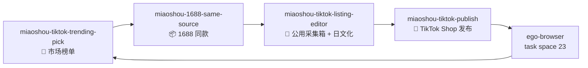
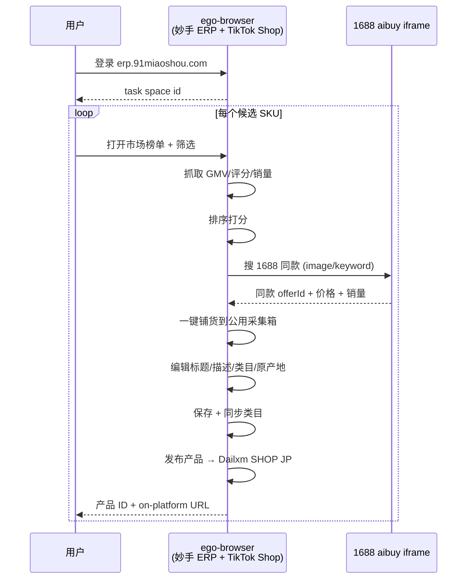

# 妙手 × 1688 × TikTok Shop 日区上架 Skill 套件

> 用一组 Codex Skill 把 **市场榜单选品 → 1688 同款铺货 → 妙手公用采集箱编辑 → TikTok Shop 日本站发布** 全流程自动化，依赖 ego-browser 复用已登录的妙手 ERP 会话。

**[English](README.en.md)**

[](#)
[](#)
[](#)
[](#)
[](#)

## 这是什么

这套 Skill 把跨平台的人工操作（妙手 ERP 浏览器 + 1688 同款浮层 + TikTok Shop 后台）拆成 4 个可串行触发的阶段，每一阶段都在真实的 Chrome 会话里完成。

- 输入：妙手 ERP 市场榜单（或手动候选清单）+ 已授权的 TikTok Shop（日本站默认）。
- 输出：一条「发布成功」记录，以及 `https://shop.tiktok.com/jp/pdp/<productId>` 的店铺页面。
- 中间产物：日文标题、日文描述 HTML、修正后的 TikTok 类目、1688 货源 `offerId`、公用采集箱行号。

核心假设：**ego-browser task space 已经登录妙手 ERP**。第一次运行需要先在 ego-browser 里手动登录 `erp.91miaoshou.com`，后续调用都复用同一个 task id。

## 快速开始

```bash
# 1. 安装（任意一种）
npx skills add peipeijiang/miaoshou-tiktok-shop-skills -g
# 或手动把仓库克隆到 ~/.codex/skills/miaoshou-tiktok-shop-skills

# 2. 在 ego-browser 里登录 erp.91miaoshou.com，记录 task space id（首次）
ego-browser task-spaces list

# 3. 在 Codex 里按顺序触发
gpt: "/miaoshou-tiktok-trending-pick country=JP maxCandidates=10 egoBrowserTaskId=23"
gpt: "/miaoshou-1688-same-source candidate=<上一步输出> egoBrowserTaskId=23"
gpt: "/miaoshou-tiktok-listing-editor rowId=<上一步输出> titleJa='...' descriptionJa='...' egoBrowserTaskId=23"
gpt: "/miaoshou-tiktok-publish rowId=<上一步输出> shopName='Dailxm SHOP' site=JP egoBrowserTaskId=23"
```

## 架构





## Skill 清单

| Skill | 阶段 | 关键产物 | 上游 | 下游 |
| --- | --- | --- | --- | --- |
| `miaoshou-tiktok-trending-pick` | 选品 | 候选 SKU 列表（含 GMV/评分/销量） | — | `miaoshou-1688-same-source` |
| `miaoshou-1688-same-source` | 货源 | 1688 `offerId` + 公用采集箱行号 | `miaoshou-tiktok-trending-pick` | `miaoshou-tiktok-listing-editor` |
| `miaoshou-tiktok-listing-editor` | 编辑 | 日文标题/描述 + 修正后类目 | `miaoshou-1688-same-source` | `miaoshou-tiktok-publish` |
| `miaoshou-tiktok-publish` | 发布 | `产品ID` + 发布记录 + on-platform URL | `miaoshou-tiktok-listing-editor` | — |

## 与现有 Skill 的关系

这套 Skill 不是孤岛，会和仓库内已有的 TikTok / 1688 Skill 协同：

| 联动 Skill | 用法 |
| --- | --- |
| `tiktok-shop-product-research` | 在 trending-pick 阶段补充产品力评分 |
| `tiktok-shop-listing-optimization` | 在 listing-editor 阶段提供日文标题/描述初稿 |
| `tiktok-shop-pricing` | 在 publish 阶段做价格规则预检 |
| `tiktok-shop-compliance` | 在 publish 阶段做违禁词 + 类目白名单预检 |
| `tiktok-shop-cross-border` | 跨境物流/退货模板补充 |
| `tiktok-shop-trending-products` | 提供大盘趋势上下文 |
| `1688-product-research` / `1688-sourcing` | 1688 同款搜索失败时退路 |
| `product-title-optimization` / `product-description-generator` | 标题与描述改写 |

## 失败恢复

每个 Skill 都返回明确的 JSON 输出。常见回退路径：

1. **登录态丢失**：在 ego-browser 重新扫码登录妙手 → 复用同一个 task id。
2. **1688 浮层空白**：刷新候选行 + 重新点击「搜 1688 同款」，或改用 keyword 搜索。
3. **类目仅限邀请**：先点「重新同步类目」，再切到「挂饰 (吊り飾り)」或「手机吊饰 & 钥匙圈」等开放类目。
4. **保存失败提示「包裹尺寸不能为空」**：用 `fillInput` 写入 15×10×8 cm，再次保存。
5. **发布卡在「发布中」超过 120s**：可能是 TikTok Shop 队列延迟，1-2 小时后再次轮询 `/move_collect/history`。

## 开发

```bash
git clone git@github.com:peipeijiang/miaoshou-tiktok-shop-skills.git
cd miaoshou-tiktok-shop-skills
# 每个 Skill 在自己的子目录，文件结构：
#   miaoshou-tiktok-trending-pick/SKILL.md
#   miaoshou-1688-same-source/SKILL.md
#   miaoshou-tiktok-listing-editor/SKILL.md
#   miaoshou-tiktok-publish/SKILL.md
git add .
git commit -m "feat(skill): add miaoshou tiktok shop skills"
git push
```

## 许可

[MIT](./LICENSE) © Shane / peipeijiang

