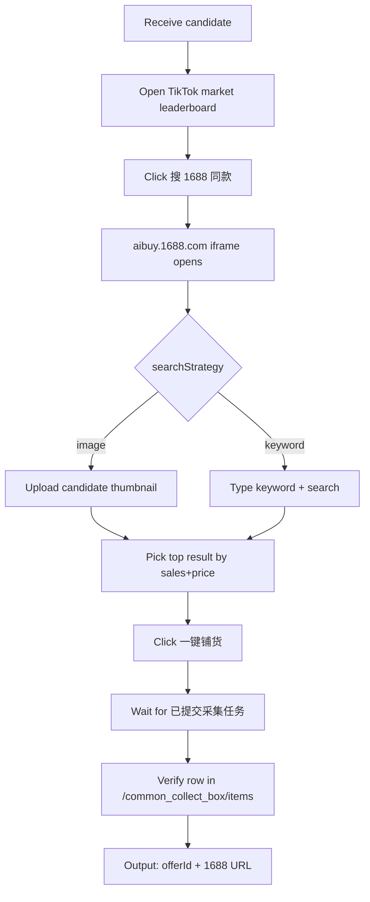

# Miaoshou → 1688 Same-Source 📦

Sends a Miaoshou TikTok leaderboard candidate into the embedded 1688 floating iframe, finds a matching 1688 supplier via image search or keyword fallback, and commits the result into the public collection box (`/common_collect_box/items`) ready for editing and claiming.

## Inputs

| Parameter        | Type   | Default    | Notes                                                                  |
| ----------------- | ------ | ---------- | ---------------------------------------------------------------------- |
| `candidate`       | object | required   | Output of `miaoshou-tiktok-trending-pick`                              |
| `searchStrategy`  | enum   | `image`    | `image` (use candidate thumbnail) or `keyword` (Japanese/English term) |
| `keyword`         | string | auto       | Only used when `searchStrategy = keyword`                              |
| `minPriceCny`     | number | `1`        | Skip offers under this price (CNY)                                     |
| `maxPriceCny`     | number | `80`       | Skip offers over this price (CNY)                                      |
| `minSales`        | number | `100`      | Require at least this many sales                                       |
| `egoBrowserTaskId`| number | required   | ego-browser task space id from the trending pick step                  |


## Required Skills

Before invoking this skill, the agent **must** detect missing dependencies and prompt
the user to install them. Do **not** auto-install silently.

| Skill | Why it is required | Install command |
| --- | --- | --- |
| `ego-browser` | Drives the Miaoshou ERP browser session | `npx skills add ego-browser -g` |
| `miaoshou-tiktok-trending-pick` | Upstream candidate SKU from leaderboard scoring | `npx skills add peipeijiang/miaoshou-tiktok-shop-skills --skill miaoshou-tiktok-trending-pick -g` |

### Detection step (run first, every time)

```bash
set -e
required_skills="ego-browser miaoshou-tiktok-trending-pick"
missing=""
for s in $required_skills; do
  if [ ! -d "$HOME/.codex/skills/$s" ] && [ ! -d "$HOME/.agents/skills/$s" ]; then
    missing="$missing $s"
  fi
done
if [ -n "$missing" ]; then
  echo "MISSING_DEPENDENCIES:$missing"
fi
```

If `MISSING_DEPENDENCIES:` prints, **stop**, then ask the user:

> Required skill(s) are not installed: `<list>`. The flow cannot run without them.
> Recommended install commands:
> ```
> <commands, one per line>
> ```
> Install now? (y/n)

If the user approves, run the commands verbatim. If not, exit and report the missing
dependencies as the result. Never proceed with the workflow on missing skills.


### Install all missing dependencies at once

```bash
npx skills add ego-browser -g
npx skills add peipeijiang/miaoshou-tiktok-shop-skills --skill miaoshou-tiktok-trending-pick -g
```

After installing, the user must reload Codex (or run `npx skills experimental_sync -y`)
so the SKILL.md files are picked up.

## Workflow



1. **Reuse or create task space** via `useOrCreateTaskSpace(taskId)`.
2. **Navigate** to `/tiktok/analytics/bestselling/product`, select the candidate's TikTok site, then search its `productId` and locate the exact leaderboard row.
3. **Click** `搜 1688 同款` next to that row. Wait for the `aibuy.1688.com/landingpage/new-home/find-products.html?…` iframe to mount.
4. **Search** the iframe:
   - If `searchStrategy = image`, upload the candidate thumbnail (`img.thumb`).
   - If `searchStrategy = keyword`, type the Japanese term (preferred) or English.
   - Wait for the result list (poll `snapshotText()` until rows appear).
5. **Filter** results by `minPriceCny` ≤ price ≤ `maxPriceCny` and `sales ≥ minSales`. Sort by sales descending. Take the top match.
6. **Click** `一键铺货` inside the embedded iframe. Confirm the parent-page toast `已提交采集任务，可前往【公用采集箱】查看`.
7. **Navigate** to `/common_collect_box/items`, search the candidate title, confirm one new row with the 1688 source offerId and `认领平台 = TikTok`.

### Embedded iframe requirement

The 1688 result page is a cross-origin out-of-process iframe (OOPIF). Opening its URL in a separate tab is useful for inspection, but its `一键铺货` action uses `postMessage` and only succeeds when the page is embedded under the Miaoshou parent. Keep the Miaoshou `/common_collect_box/alibaba_cross_hot_spots` tab open and attach to its child target with CDP when ordinary DOM helpers cannot see the iframe:

1. Call `Target.getTargets` and select the `type = iframe` target whose `parentId` is the Miaoshou parent tab.
2. Call `Target.attachToTarget` with `flatten: false`.
3. Evaluate search and row-selection code through `Target.sendMessageToTarget`.
4. Verify the confirmation dialog in the Miaoshou parent, then verify the new row under the `已认领` tab in the public collection box.

Do not report success from a button click alone. Success requires both the parent confirmation and a new collection-box row with a concrete offerId.

## Output

```json
{
  "candidateProductId": "1737429783344874791",
  "source": "1688",
  "sourceItemId": "1012964709304",
  "sourceTitle": "可爱卡通趣味仿真美食公仔毛绒挂件活动礼品蛋糕法棍玩偶钥匙扣",
  "sourcePriceCny": 2.00,
  "sourceSales": 198696,
  "sourceShopName": "义乌市冉钧玩具有限公司",
  "sourceUrl": "http://detail.1688.com/offer/1012964709304.html",
  "publicCollectionBoxRowId": "3986003071",
  "collectedAt": "2026-09-11T17:35:12+08:00"
}
```

## Failure Behavior

| Symptom                                                | Likely cause                              | Recovery                                                                          |
| ---------------------------------------------------- | --------------------------------------- | ------------------------------------------------------------------------------- |
| Iframe `aibuy.1688.com` fails to load                | Ad-blocker / cookie scope              | Allow third-party cookies; reload the row; re-click `搜 1688 同款`.             |
| Direct 1688 tab click produces no Miaoshou result    | `postMessage` has no Miaoshou parent   | Return to the embedded OOPIF and trigger `一键铺货` there.                      |
| Search returns 0 rows                                | Query too narrow                       | Switch `searchStrategy` from `keyword` to `image`; lower `minSales`.           |
| `认领平台 = 空` after collection                    | Shop authorization missing             | Authorize at `/auth/partner/tiktokBusiness`.                                    |
| 采集弹框 returns `接Allegro官方通知…禁止发布Allegro` | Source listed on Allegro              | Reject and re-pick the second result; flag for review.                          |
| Same candidate collected twice                       | Idempotency missing                     | Compare `publicCollectionBoxRowId` with previously persisted results; reuse before re-collect. |

## Required Cookies & Permissions

- Miaoshou ERP session, AliExpress/Alibaba iframe session (single-sign-on via Miaoshou).
- 1688 app key in Miaoshou org config (`customerId=miaoshou&appKey=3450231&authToken=…`).
- Outbound network to `aibuy.1688.com` and `detail.1688.com`.

## Pair With

- `miaoshou-tiktok-trending-pick` — upstream.
- `miaoshou-tiktok-listing-editor` — consumes the output.
- `1688-sourcing` / `1688-product-research` — alternate research paths when search returns nothing.

## Example Invocation

```
For candidate productId 1737429783344874791, find a 1688 supplier under 80 CNY with at
least 100 sales, prefer image match. Return the offerId and public collection box row id.
```
