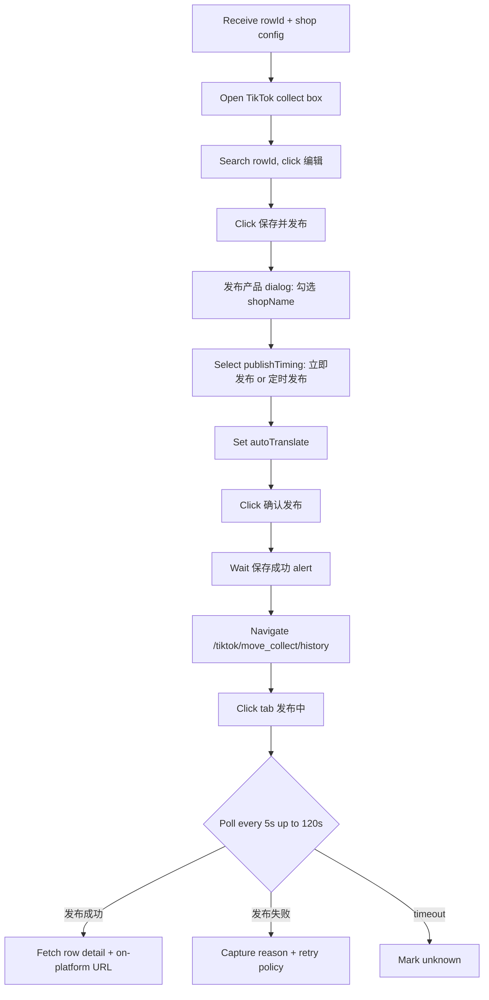

# Miaoshou → TikTok Publish 🚀

Drives the Miaoshou `保存并发布` button through the `发布产品` dialog, selects the authorized shop, language, and timing, then polls the publish history page to surface the final status and (when available) the on-platform product URL.

## Inputs

| Parameter         | Type   | Default       | Notes                                                                       |
| ------------------ | ------ | ------------- | --------------------------------------------------------------------------- |
| `rowId`            | string | required      | `commonCollectBoxDetailId` returned by `miaoshou-1688-same-source`         |
| `shopName`         | string | required      | Must match an authorized TikTok Shop name (e.g. `Dailxm SHOP`)              |
| `site`             | enum   | `JP`          | JP / KR / SG / MY / TH / VN / PH / ID / US / GB                              |
| `publishTiming`    | enum   | `immediate`   | `immediate` or `scheduled` (requires ISO datetime)                         |
| `scheduledAt`      | string | _required if `scheduled`_ | ISO-8601 local time, e.g. `2026-09-12T09:00:00+08:00`              |
| `autoTranslate`    | enum   | `ja`          | `ja` / `en` / `ko` / `zh` — sets the `自动翻译` dropdown                       |
| `autoReport`       | bool   | `false`       | Toggle "产品发布成功后自动提报商机"                                          |
| `egoBrowserTaskId` | number | required      |                                                                             |


## Required Skills

Before invoking this skill, the agent **must** detect missing dependencies and prompt
the user to install them. Do **not** auto-install silently.

| Skill | Why it is required | Install command |
| --- | --- | --- |
| `ego-browser` | Drives the Miaoshou ERP browser session | `npx skills add ego-browser -g` |
| | `ego-browser` | drives the Miaoshou browser session | `npx skills add ego-browser -g` |
| `miaoshou-tiktok-listing-editor` | upstream: provides the edited row | `npx skills add peipeijiang/miaoshou-tiktok-shop-skills --skill miaoshou-tiktok-listing-editor -g` |
| `tiktok-shop-pricing` | pre-checks pricing rules and currency | `npx skills add nexscope-ai/eCommerce-Skills --skill tiktok-shop-pricing -g` |
| `tiktok-shop-compliance` | pre-checks forbidden words | `npx skills add nexscope-ai/eCommerce-Skills --skill tiktok-shop-compliance -g` | | see below | see below |

### Detection step (run first, every time)

```bash
set -e
required_skills="ego-browser miaoshou-tiktok-listing-editor tiktok-shop-pricing tiktok-shop-compliance"
missing=""
for s in $required_skills; do
  for d in "$HOME/.codex/skills/$s" "$HOME/.agents/skills/$s"; do
    if [ -d "$d" ]; then missing="$missing"; break; fi
    missing="$missing $s"
    break
  done
done
if [ -n "$missing" ]; then
  echo "MISSING_DEPENDENCIES:$missing"
fi
```

If `MISSING_DEPENDENCIES:` prints, **stop**, then ask the user:

> Required skill(s) are not installed: `<list>`. The flow cannot run without them.
> Recommended install commands:
> ```
> <commands, one per line>
> ```
> Install now? (y/n)

If the user approves, run the commands verbatim. If not, exit and report the missing
dependencies as the result. Never proceed with the workflow on missing skills.


### Install all missing dependencies at once

```bash
npx skills add ego-browser -g
npx skills add peipeijiang/miaoshou-tiktok-shop-skills --skill miaoshou-tiktok-listing-editor -g
npx skills add nexscope-ai/eCommerce-Skills --skill tiktok-shop-pricing -g
npx skills add nexscope-ai/eCommerce-Skills --skill tiktok-shop-compliance -g
```

After installing, the user must reload Codex (or run `npx skills experimental_sync -y`)
so the SKILL.md files are picked up.

## Workflow



1. **Reuse or create task space** via `useOrCreateTaskSpace(taskId)`.
2. **Navigate** to `/tiktok/collect_box/items`, search by `rowId` (alias of `commonCollectBoxDetailId`), click `编辑`.
3. **Click** `保存并发布`. Wait for the `发布产品` dialog.
4. **Configure** the dialog:
   - Check the checkbox next to `shopName`.
   - Pick `publishTiming`: `立即发布` (radio button `立即发布`) or `定时发布` (radio + datetime).
   - Pick `autoTranslate` from the `自动翻译` dropdown (default `日语`).
   - Leave `价格误设防范`, `防重复`, `主图随机排序` at their defaults unless the shop requires changes.
5. **Click** `确认发布`. Wait for `保存成功` alert.
6. **Navigate** to `/tiktok/move_collect/history`. Switch to the `发布中` tab. Poll every 5s, up to 120s, until the row either shows `发布成功` (with `产品ID` populated) or `发布失败` (with a reason).
7. **On success, locate** the on-platform product URL by visiting `https://seller.tiktokshopglobalselling.com/homepage?shop_region=JP`, opening `商品管理 → 商品`, searching by `产品ID`. Capture the URL.

## Output

```json
{
  "rowId": "3986003071",
  "shopName": "Dailxm SHOP",
  "site": "JP",
  "publishStatus": "发布成功",
  "publishedAt": "2026-09-11T18:21:04+08:00",
  "productId": "1737429900123456789",
  "productTitle": "かわいい食品道具 ぬいぐるみキーホルダー バッグチャーム",
  "onPlatformUrl": "https://shop.tiktok.com/jp/pdp/1737429900123456789",
  "historyUrl": "https://erp.91miaoshou.com/tiktok/move_collect/history?..."
}
```

## Failure Behavior

| Symptom                                                          | Likely cause                                       | Recovery                                                                                                         |
| ---------------------------------------------------------------- | -------------------------------------------------- | ---------------------------------------------------------------------------------------------------------------- |
| `保存并发布` button disabled                                   | Validation error                                  | Click 检测违禁词 to surface the failing token; remediate upstream via `miaoshou-tiktok-listing-editor`.         |
| Shop not listed in dialog                                      | Shop not authorized                               | Authorize at `/auth/partner/tiktokBusiness`; retry.                                                              |
| `发布失败` reason `当前类目非主营类目`                       | Category restricted                               | Re-run `miaoshou-tiktok-listing-editor` with a different category.                                                |
| `发布失败` reason `缺少运费模板`                              | Missing shipping template                         | Set one at `/tiktok/item/template_management`.                                                                   |
| `发布失败` reason `图片需为800×800`                          | Image size wrong                                  | Use the in-page image translation / resize button, or re-collect from 1688 with a 800×800 variant.               |
| Poll timeout at 120s with row still in `发布中`             | TikTok Shop queue delay                          | Re-poll later (manual delay on TikTok side); record `pending` in output.                                          |
| `确认发布` button click ignored                               | Modal overlay still rendering                     | Sleep 500ms then re-click; if still ignored, refresh the page and re-edit.                                       |

## Required Cookies & Permissions

- Miaoshou ERP session in the supplied ego-browser task space.
- Authorized TikTok Shop on the target site (e.g. JP). See `/auth/partner/tiktokBusiness`.
- For scheduled publishing: `publishTiming = scheduled` requires the shop to have scheduled-publish enabled in TikTok Seller Center.
- Outbound network to `erp.91miaoshou.com`, `tiktok-static-c{1..4}.chengji-inc.com`, `seller.tiktokshopglobalselling.com`.

## Pair With

- `miaoshou-tiktok-listing-editor` — upstream.
- `tiktok-shop-pricing` — pre-check pricing rules and currency.
- `tiktok-shop-compliance` — pre-check forbidden words before clicking `确认发布`.

## Example Invocation

```
Publish row 3986003071 to Dailxm SHOP (JP) immediately with auto-translate to 日本語.
Return the product URL and the publish history row URL.
```
